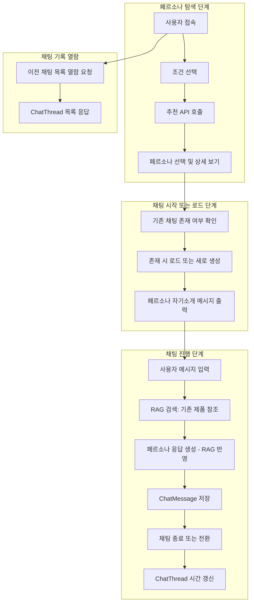
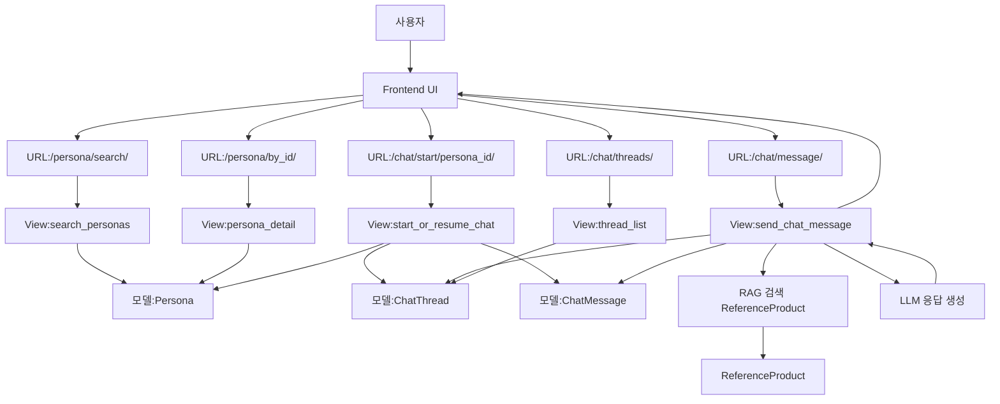

# Django 웹서비스 개발 문서 구조 (RAG 기반 설계 v4)
## 1. 시스템 워크플로우

### 목적
이 웹서비스는 마케터 또는 기획자가 특정 페르소나와 1:1로 대화하며
신제품, 프로모션, 마케팅 전략에 대한 가상의 인터뷰를 수행할 수 있는 시뮬레이션 도구이다.
사용자는 페르소나를 선택한 후, 자연어로 신제품 혹은 진행 예정 프로모션을 제시하고 구매의사 등 의견을 묻는다.
페르소나는 자신의 성향과 기존 제품 데이터를 참고하여 응답을 생성한다.

### 사용자 흐름

---

## 2. 기능 명세서

### persona 앱
| 기능명        | URL                | 방식   | 설명                  |
| ---------- | ------------------ | ---- | ------------------- |
| 페르소나 목록 조회 | /persona/search    | GET  | 조건 기반 필터링           |
| 페르소나 상세 조회 | /persona/{id}      | GET  | 선택된 페르소나 정보         |
| 유사 페르소나 추천 | /persona/recommend | POST | 조건 기반 유사 페르소나 추천 반환 |


### chat 앱
| 기능명          | URL                       | 방식   | 설명                             |
| ------------ | ------------------------- | ---- | ------------------------------ |
| 채팅 시작 또는 로드  | /chat/start/{persona_id} | GET  | 기존 ChatThread가 있으면 재사용, 없으면 생성 |
| 채팅 메시지 송수신   | /chat/message             | POST | 메시지 송수신 및 저장                   |
| 채팅 스레드 목록 조회 | /chat/threads             | GET  | 사용자의 모든 대화 이력 반환               |
| 채팅 스레드 삭제    | /chat/thread/{id}/delete  | POST | 특정 스레드 삭제 처리                   |

### api 앱

| 기능명 | URL | 방식 | 설명 |
|--------|-----|------|------|
| 페르소나 필터 API | /api/personas/filter/ | GET | 조건 기반 필터링 결과 JSON 반환 |
| 페르소나 프로필 API | /api/persona/profile/ | GET | 선택된 페르소나 JSON 반환 |
| 채팅 메시지 API | /api/chat/send/ | POST | 사용자 메시지 전달 및 페르소나 응답 생성 |
| 타임스탬프 갱신 API | /api/chat/last_updated/ | POST | 채팅 종료 시점 기록 갱신 처리 |


---

## 3. 모델 정의서
### Persona

- id: PK
- name
- segment (마이크로세그먼트)
- age_group : 연령대
- family_structure : 가족구성
- gender
- customer_value : RFM세그먼트
- purchase_pattern : 소비패턴 - 취향(주요 구매 품목/카테고리)
- lifestyle : 소비패턴 - 성향
- job 
- persona_summary_tag: TextField (페르소나 요약 설명)
- (삭제) created_at

### ChatThread

- id: PK
- persona: OneToOneField → Persona
- created_at
- last_updated

### ChatMessage

- id: PK
- thread: FK → ChatThread
- sender: CharField ("user" or "persona")
- message: TextField
- timestamp

### ReferenceProduct

- product_id: CharField
- name: CharField
- attributes: JSONField
- monthly_sales: List[Dict] (예: [{ "month": "2024-01", "volume": 12000 }])
- segment_share: Dict (예: { "웰빙VIP": 0.42, "가성비": 0.18 })
- seasonal_trend: TextField
- promotion_effect: FloatField (0.0 ~ 1.0)
- summary: TextField (RAG용 문장화)

---

## 4. API 명세서

### /api/chat/send/

``` json
POST /api/chat/send/

{
  "thread_id": 3,
  "message": "이 제품은 어떤 고객이 좋아할까요?"
}

응답:
{
  "response": "웰빙 추구형 VIP 고객이 이 제품에 반응할 가능성이 높아요."
}

``` 

### /api/personas/filter/

```http

GET /api/personas/filter?age_group=30대&gender=여&lifestyle=웰빙
```

응답:

```json

[
  { "id": 12, "name": "30대 여성 웰빙형", "rfm": "VIP" }
]
```

### /api/chat/last_updated/

```json
POST /api/chat/last_updated/

{
  "thread_id": 3
}

응답:
{ "status": "ok", "updated": "2025-08-06T10:12:00" }
```

### /api/chat/threads/

```json
GET /api/chat/threads

응답:

[
  {
    "thread_id": 3,
    "persona_name": "30대 여성 웰빙형",
    "last_updated": "2025-08-05T22:13:00"
  },
  ...
]
```

---

## 5. RAG 데이터 구조

- 문서 1건 = 1 제품 + 1 기간 + 1 문서 유형
- 예시 문서 ID: `헬씨참치_2024_02_월별`, `헬씨참치_segment_summary`, `헬씨참치_연간요약`

### 문서 예시

```
헬씨참치 라이트캔은 2024년 2월 기준 24,000개가 판매되었으며, 총 매출은 3.2억 원이었다.  
웰빙추구형 VIP 세그먼트가 42%를 차지했다.  
이 제품은 고단백, 저염, 비건 속성으로 건강 선호층의 반응이 높았다.
```

---

## 6. 앱별 책임 분장

| 앱 | 담당자 | 역할 |
|----|--------|------|
| persona | 주용곤 | 목록, 추천, 상세 조회 |
| chat | 최장호 | 채팅 로직, 메시지 관리 |
| api | 박동현 | API 구성 및 응답 로직 |
| frontend | 최장호/박진성 | 사용자 인터페이스 |
| 모델 설계 | 박진성 | 데이터베이스 구조 정의 |

---

## 7. 컴포넌트 다이어그램




---

## 7-1. 참고 

### 컴포넌트 다이어그램 보충 설명 정리
| 노드                     | 예상 위치                            | 기능 요약                              |
| ---------------------- | -------------------------------- | ---------------------------------- |
| `search_personas`      | `persona/views.py`               | 조건에 맞는 페르소나 목록 반환 (GET)            |
| `persona_detail`       | `persona/views.py`               | 페르소나 상세 정보 반환 (GET)                |
| `start_or_resume_chat` | `chat/views.py`                  | ChatThread 유무에 따라 복원 또는 생성 (GET)   |
| `send_chat_message`    | `chat/api.py` 또는 `chat/views.py` | 사용자 입력 → 메시지 저장 + LLM 응답 생성 (POST) |
| `thread_list`          | `chat/views.py`                  | 모든 이전 ChatThread 목록 반환 (GET)       |

### 실제 프로젝트 구조에서의 예시

```plaintext
project_root/
├── persona/
│   └── views.py
│       ├── def search_personas(request): ...
│       └── def persona_detail(request, id): ...
│
├── chat/
│   ├── views.py
│   │   ├── def start_or_resume_chat(request, persona_id): ...
│   │   └── def thread_list(request): ...
│   └── api.py
│       └── def send_chat_message(request): ...
```